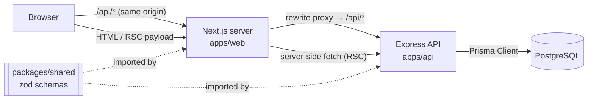
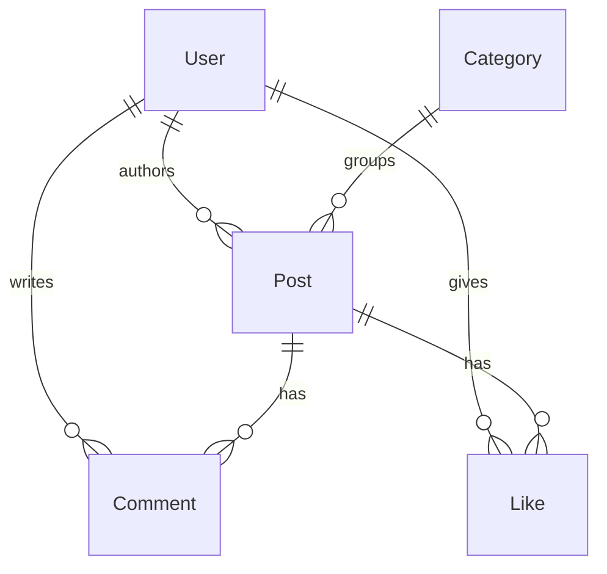

# System Design

## 1. Overview

A blogging platform split into two deployable applications plus one shared library, in a single
npm-workspaces monorepo:

| Workspace | What it is | Runs on |
|---|---|---|
| `apps/web` | Next.js 16 (App Router) + React 19 + Tailwind | Vercel |
| `apps/api` | Express 4 REST API + Prisma 5 | Render |
| `packages/shared` | Zod schemas + inferred TypeScript types | compiled, imported by both |

The API is a standalone service rather than Next.js route handlers. That costs an extra network
hop and a second deployment target, and buys three things: the REST API is consumable by clients
that aren't this web app, the backend can be tested end-to-end with Supertest without booting
Next.js, and business logic can't quietly leak into React components. For an assessment that asks
for "a RESTful API" as a named deliverable, having it exist as its own artifact is also the point.



## 2. Layering inside the API

Each request falls through four layers, each with one job:

```
routes/        HTTP shape: paths, status codes, cookies      (auth.routes.ts, post.routes.ts, …)
  ↓ validate(schema) middleware — zod parse, 400 on failure
services/      business rules: ownership, slug uniqueness    (post.service.ts, …)
  ↓
repositories/  the only modules allowed to import prisma     (post.repository.ts, …)
  ↓
lib/prisma.ts  a single PrismaClient instance
```

The rule that gives this teeth: **`prisma` is imported in `repositories/` and nowhere else.** That
single constraint is what makes services unit-testable without a database, and it's the subject of
[`design-pattern.md`](design-pattern.md).

Why services are factories (`createPostService(repository = postRepository)`) rather than plain
objects: it's constructor injection without a DI container. Production code imports the ready-made
`postService` singleton; tests call the factory with a mock. No framework, no decorators, no
container wiring — one default parameter.

## 3. Data model



Decisions worth calling out:

- **`Like` has a composite primary key `@@id([postId, userId])`.** One row per user per post is
  enforced by the database, not by application code — a double-click or a duplicate request can't
  create a second like, and the "unlike" path is a delete by that same key.
- **Cascade rules are explicit.** Deleting a user or post cascades to its comments and likes;
  deleting a category sets `Post.categoryId` to `NULL` rather than deleting posts. Cleanup is the
  database's job, so no orphan-sweeping code exists in the services.
- **`Post.slug` is unique** and is what URLs address (`/posts/:slug`), so post URLs are readable and
  stable. `createPost` derives the slug from the title and appends `-2`, `-3`, … until it finds a
  free one.
- **Indexes on `Post.authorId` and `Post.categoryId`** back the two list filters the API exposes
  (`?authorId=`, `?category=`), and `Comment.postId` backs the per-post comment fetch.
- **`excerpt` is stored, not computed on read.** It's derived from the content at write time when
  the author doesn't supply one, so the list endpoint never has to load or truncate full post
  bodies.

## 4. Validation and the shared package

`packages/shared` holds Zod schemas (`CreatePostInputSchema`, `RegisterInputSchema`, …) and exports
the types inferred from them. Both apps import it.

This is the one piece of duplication the monorepo exists to remove. The API validates with
`validate(CreatePostInputSchema)` before a handler runs; the web form validates with the same
object before submitting; the `CreatePostInput` type both sides pass around is `z.infer` of that
same object. A rule like "title max 200 chars" is written once. Client and server validation cannot
drift apart, because there is only one of them — and the type can't drift from the validator either,
since it's derived rather than declared.

Server-side validation is the real enforcement; the client-side pass exists only to avoid a
round-trip for obvious mistakes.

Environment variables get the same treatment in `apps/api/src/config/env.ts`: a Zod schema parsed
at import time, which throws on boot if `DATABASE_URL` is malformed or `JWT_SECRET` is under 16
characters. A misconfigured deploy fails immediately and loudly instead of at the first request
that happens to need the missing value.

## 5. Authentication

JWT (`{ sub: userId }`, 7-day expiry) in an **httpOnly** cookie.

- httpOnly means the token is unreachable from JavaScript, so XSS can't exfiltrate it — unlike
  `localStorage`, the usual alternative.
- `sameSite: 'lax'` blocks the cookie on cross-site POSTs, which is the CSRF vector that matters
  here.
- `secure` is on whenever `NODE_ENV === 'production'`.
- The trade-off accepted: a cookie is sent automatically, so it can't be scoped per-request the way
  an `Authorization` header can, and it needs the same-origin arrangement described below.

The flow:

1. `POST /api/auth/login` verifies the bcrypt hash and calls `res.cookie('token', …)`.
2. The browser attaches that cookie to later requests; `requireAuth` verifies it and sets
   `req.userId`.
3. Handlers pass `req.userId` into services, which compare it against `post.authorId` before
   allowing an edit or delete.

**Authorization lives in the service layer, not in middleware**, because "you can only edit your own
posts" needs the post loaded to be checked at all. Keeping it in `updatePost`/`deletePost` means the
rule is enforced wherever those are called from, and it's tested with a mock repository, no HTTP
involved.

### Why the web app proxies `/api/*`

Web (`*.vercel.app`) and API (`*.onrender.com`) are different registrable domains in production.
A cookie set by the API domain is third-party to the web app: browsers increasingly refuse to send
it, and `cookies()` on the Next server can't read it at all.

So `next.config.js` rewrites `/api/:path*` to the API, and `apps/web/src/lib/api-client.ts` uses
`BASE_URL = ''` in the browser. Every browser request goes to the web app's own origin and is
proxied server-side to the API. The auth cookie is first-party to the only domain the browser talks
to. Server-side code (RSC, server actions) isn't subject to cookie policy and calls the API
directly, forwarding the cookie header explicitly when it needs to
(`getInitialUser` in `lib/auth-server.ts`).

One consequence worth knowing: because Next inlines `NEXT_PUBLIC_*` and serializes rewrites into the
routes manifest at build time, the API URL is fixed when the image is built, not when it starts.
That's why the Docker Compose setup passes it as a build arg.

## 6. Frontend state and data flow

**Server-rendered data, client-managed session.** Two different problems, two different mechanisms:

- **Post/comment/category data** is fetched in React Server Components (`lib/data.ts`) and never
  enters client state. No loading spinners, no `useEffect` fetches, no client-side cache to
  invalidate.
- **The session** (`AuthContext`) is Context API, as the assessment requires a choice between
  Context and Redux. The state it holds is one nullable user object plus three actions. Redux —
  store, reducers, middleware, provider — would be ceremony around a value that changes at login and
  logout and never in between. Context is the proportionate tool. If this app grew optimistic
  cross-page mutations, that judgement would flip.

The auth state avoids the usual flash of logged-out UI: the root layout resolves the user on the
server (`getInitialUser`) and passes it to `AuthProvider` as `initialUser`, so the first paint is
already correct. The client-side `/api/auth/me` fetch only runs when no server-rendered value was
provided.

Caching uses Next's `'use cache'` with tags: `getPosts` is tagged `posts`, `getPost(slug)` is tagged
`post:${slug}`. After a mutation, a server action calls `updateTag('posts')` — so a new post
invalidates exactly the list and that post's page, not the whole site.

## 7. Error handling

API errors are a small class hierarchy (`AppError` → `ValidationError` 400, `UnauthorizedError` 401,
`ForbiddenError` 403, `NotFoundError` 404, `ConflictError` 409). Services throw them; a single
Express error middleware maps them to responses. Anything that *isn't* an `AppError` is an
unanticipated bug: it's logged server-side and returned as a bare `500 Internal server error`, so
stack traces and Prisma internals never reach a client.

Because Express 4 doesn't catch rejected promises from async handlers, every async route is wrapped
in `asyncHandler` — without it a rejected promise hangs the request instead of reaching the error
middleware.

On the client, `apiClient` converts any non-2xx response into a typed `ApiError` carrying `status`
and the field-level `details` from Zod, which forms render inline. The App Router's `error.tsx`,
`loading.tsx`, and `not-found.tsx` cover the render-time cases.

## 8. Testing strategy

Two layers, deliberately:

- **Unit tests** (`apps/api/tests/unit/`) inject mock repositories into the service factories. They
  cover business rules — ownership checks, duplicate-email conflicts, like toggling — in seconds,
  with no database.
- **Integration tests** (`apps/api/tests/`) drive the real Express app with Supertest against a real
  Postgres, covering what mocks can't: middleware order, cookie behavior, status codes, actual SQL.
- **Frontend tests** use Jest + React Testing Library on the components with real logic in them
  (`PostForm`, `CommentSection`, `LikeButton`, `AuthContext`).

CI runs both, plus lint, typecheck, and a build, as separate jobs — `test-api` gets a Postgres
service container; `build-*` is gated on its own app's lint and test jobs. Splitting per app means a
frontend failure doesn't mask a backend one, and the two run in parallel.

## 9. Deployment

| Concern | Production | Local Docker Compose |
|---|---|---|
| Web | Vercel (auto-deploy on push to `main`) | `web` container, `next start` |
| API | Render (auto-deploy on push to `main`) | `api` container |
| Database | Supabase Postgres | `postgres:16-alpine` container |
| Migrations | `prisma migrate deploy` | same, on API container start |

Deployment runs through Vercel's and Render's first-party GitHub integrations rather than a custom
Actions workflow. Both platforms already have credentialed access to the repo; re-implementing that
in Actions would mean storing deploy tokens as secrets to reproduce a behavior that's on by
default. CI stays a pure quality gate.

Prisma is configured with both `url` and `directUrl` because Supabase offers a pooled (PgBouncer,
transaction-mode) endpoint and a direct one. Queries go through the pooler — serverless functions
open many short-lived connections and would exhaust Postgres's connection limit otherwise — while
migrations need the direct connection, since PgBouncer's transaction mode can't run the DDL and
advisory locks Prisma migrations depend on.

The `lib/prisma.ts` singleton exists for the same class of reason in development: `tsx watch`
rebuilds the module graph on every save, and without caching the client on `global`, each reload
would construct a new `PrismaClient` and a new connection pool while the old one is never torn down.

## 10. Known trade-offs

Things that are deliberately simple, and what would change them:

- **No pagination.** `GET /api/posts` returns every post. Correct for a demo dataset, wrong at a few
  thousand rows; the fix is cursor pagination on `createdAt` (the column already has the ordering
  index it would need).
- **No rate limiting** on login or registration. `express-rate-limit` on `/api/auth/*` would be the
  first thing to add before this faced real traffic.
- **Single JWT, no refresh token.** A 7-day token can't be revoked before it expires. Revocation
  needs either short-lived access tokens plus a refresh flow, or a server-side session store.
- **`resolveCategoryId` handles its race by catching the unique-constraint failure and re-reading.**
  A Postgres `INSERT … ON CONFLICT DO NOTHING RETURNING` would do it in one round trip; the current
  version is correct but chattier.
- **Author names aren't returned on the post list.** The list `include` fetches category and counts
  only. Adding the author relation is a one-line change to `postInclude` when the UI needs it.
