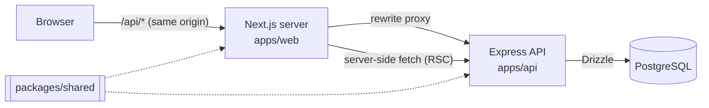
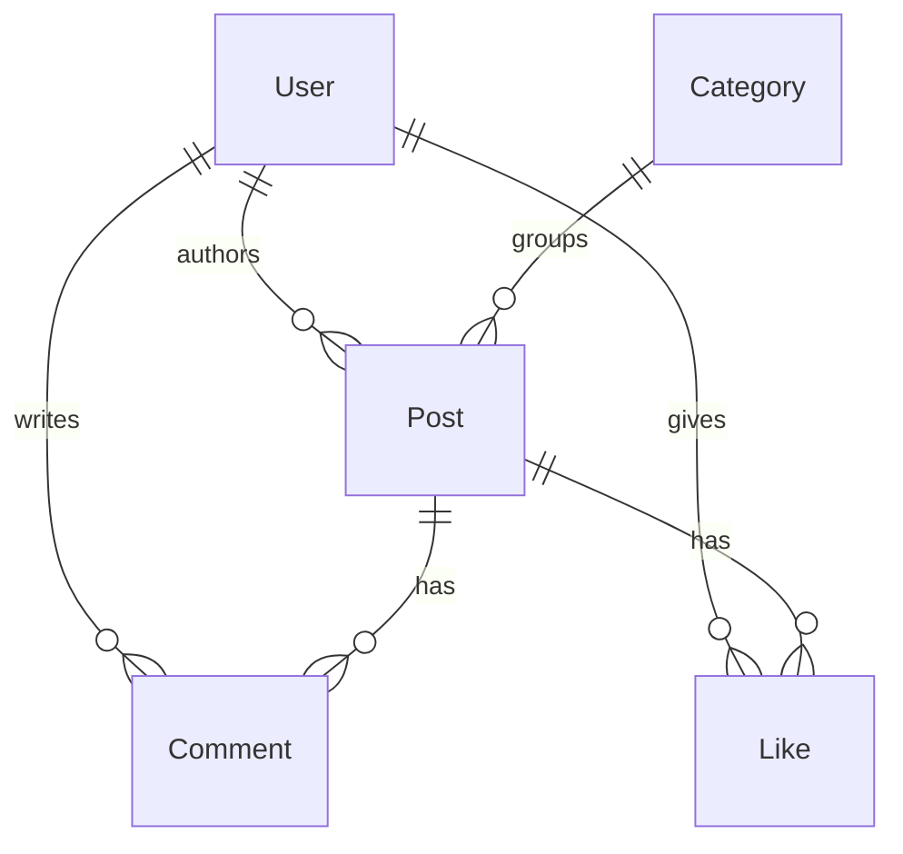

# System Design

## 1. Overview

Two deployable apps plus a shared library, in one npm-workspaces monorepo:

| Workspace | What | Runs on |
|---|---|---|
| `apps/web` | Next.js 16 (App Router) + React 19 + Tailwind | Vercel |
| `apps/api` | Express 4 REST API + Drizzle ORM | Render |
| `packages/shared` | Zod schemas + inferred types | imported by both |

The API is a standalone service, not Next route handlers. It costs an extra hop and a second
deploy target, and buys a REST API other clients can use, Supertest coverage without booting
Next.js, and no business logic drifting into React components.



## 2. API layering

```
routes/        HTTP: paths, status codes, cookies
  ↓ validate(schema) — zod parse, 400 on failure
services/      business rules: ownership, slug uniqueness
  ↓
repositories/  the only modules that import db
  ↓
db/index.ts    one postgres.js pool + Drizzle instance
db/schema.ts   tables, relations, inferred row types
```

**`db` is imported in `repositories/` and nowhere else** (plus the health check and the seed/migrate
scripts, which are not request paths). That single rule is what makes services testable without a
database — see [design-pattern.md](design-pattern.md) — and it is what let the ORM be swapped from
Prisma to Drizzle without editing a service.

## 3. Data model



- **`Like` uses a composite PK `@@id([postId, userId])`** — one like per user per post, enforced by
  the database. Unlike is a delete by the same key.
- **Cascades are explicit.** Deleting a user or post removes its comments and likes; deleting a
  category sets `Post.categoryId` to `NULL`. No cleanup code in the services.
- **`Post.slug` is unique** and addresses the URL. `createPost` derives it from the title, appending
  `-2`, `-3`, … until free.
- **Indexes** on `Post.authorId`, `Post.categoryId`, `Comment.postId` back the filters the API
  exposes.
- **`excerpt` is stored, not computed** — derived at write time, so the list endpoint never loads
  full post bodies.

## 4. Validation

`packages/shared` holds the Zod schemas and exports types inferred from them. The API validates with
`validate(CreatePostInputSchema)`; the web form validates with the same object; the shared
`CreatePostInput` type is `z.infer` of it. One rule, one definition — client and server validation
can't drift, and the type can't drift from the validator.

Server-side validation is the enforcement; the client pass just avoids a round-trip.

`apps/api/src/config/env.ts` applies the same idea to environment variables — a Zod schema parsed at
import time, so a bad `DATABASE_URL` or a short `JWT_SECRET` fails at boot instead of at first use.

## 5. Authentication

JWT (`{ sub: userId }`, 7-day expiry) in an httpOnly cookie.

- **httpOnly** — unreachable from JavaScript, so XSS can't steal it (unlike `localStorage`).
- **`sameSite: 'lax'`** — blocks the cookie on cross-site POSTs (CSRF).
- **`secure`** — on in production.

Flow: `POST /api/auth/login` verifies the bcrypt hash and sets the cookie → `requireAuth` verifies
it and sets `req.userId` → services compare that against `post.authorId` before an edit or delete.

**Authorization lives in the service layer**, not in middleware, because "you can only edit your own
posts" needs the post loaded to be checked at all.

### Data Access Layer (web side)

The web app's auth checks live in `apps/web/src/lib/dal.ts` and nowhere else — the same idea as
repositories on the API: put the rule next to the data so callers can't skip it.

| Function | Guarantee |
|---|---|
| `getOptionalUser()` | user or `null`, never redirects |
| `verifySession()` | a verified user, or redirect to `/login` |
| `getMyPosts()` | verifies the session, returns only that user's posts |
| `getPostForEdit(slug)` | session **and** ownership |
| `isPostAuthor(id)` / `getLikeStatus(id)` | ownership / like state, `false` when logged out |

Pages are then pure rendering: `/posts/new` is `await verifySession()` and a form, `/dashboard` is
`await getMyPosts()` and a list. None of them inspect the session.

- **Checks can't be forgotten** — a new page or server action that calls a DAL function is
  authorized whether or not its author thought about auth.
- **`import 'server-only'`** makes importing the DAL from a client component a build error.
- **`cache()`** on each function means one `/api/auth/me` per render pass.

**Not `proxy.ts`** (Next 16's `middleware.ts`): it runs in the edge runtime where `jsonwebtoken`
can't run, so it could only check that a cookie exists, not that it's valid. Next's docs agree —
security checks belong "as close as possible to your data source."

**Not in components**: a check in a page protects only that page; in a client component it's a
`useEffect` redirect after a blank frame, plus a fetch waterfall on the edit page.

All of it is UX, not the security boundary — the API re-checks everything, and `curl` skips the web
app entirely.

### Why `/api/*` is proxied

Web (`*.vercel.app`) and API (`*.onrender.com`) are different registrable domains, so a cookie set
by the API is third-party to the web app: browsers won't send it, and `cookies()` on the Next server
can't read it.

So `next.config.js` rewrites `/api/:path*` to the API and the browser only ever calls its own
origin, keeping the cookie first-party. Server-side code isn't subject to cookie policy and calls
the API directly, forwarding the cookie header itself.

Because Next inlines `NEXT_PUBLIC_*` and bakes rewrites into the routes manifest at build time, the
API URL is fixed when the image is built — hence the Docker build arg.

## 6. Frontend state

**Server-rendered data, client-managed session.**

- **Post/comment/category data** is fetched in Server Components (`lib/data.ts`) and never enters
  client state.
- **The session** (`AuthContext`) is Context API. It holds one nullable user plus three actions —
  Redux would be ceremony around a value that changes only at login and logout.

Pages are server components; `'use client'` starts as deep in the tree as possible. The edit and new
pages fetch and authorize server-side, then pass a plain object to a thin client form.

The root layout resolves the user via `getOptionalUser()` and seeds `AuthProvider`, so there's no
flash of logged-out UI. Client components can't import the DAL, so they receive identity through
that provider and use it only for affordances (navbar links, like button state). Ownership decisions
stay server-side: `PostOwnerActions` renders only when `isPostAuthor()` says so.

Caching uses `'use cache'` with tags — `posts`, `post:${slug}` — and mutations call `updateTag()`,
so a new post invalidates the list and that post only.

## 7. Error handling

API errors are a class hierarchy: `AppError` → `ValidationError` (400), `UnauthorizedError` (401),
`ForbiddenError` (403), `NotFoundError` (404), `ConflictError` (409). Services throw them; one
Express middleware maps them to responses. Anything that isn't an `AppError` is logged and returned
as a bare `500`, so stack traces never reach a client.

Every async route is wrapped in `asyncHandler` — Express 4 doesn't catch rejected promises, and
without it a rejection hangs the request instead of reaching the error middleware.

On the client, `apiClient` turns any non-2xx into a typed `ApiError` carrying `status` and Zod's
field-level `details`, which forms render inline.

## 8. Testing

- **Unit** (`apps/api/tests/unit/`) — mock repositories injected into service factories. Business
  rules in seconds, no database.
- **Integration** (`apps/api/tests/`) — Supertest against real Postgres: middleware order, cookies,
  status codes, actual SQL.
- **Frontend** — Jest + React Testing Library on the components with real logic.

CI runs these as separate per-app jobs so a frontend failure doesn't mask a backend one.

## 9. Deployment

| | Production | Docker Compose |
|---|---|---|
| Web | Vercel | `web` container |
| API | Render | `api` container |
| Database | Supabase Postgres | `postgres:16-alpine` |
| Migrations | `db:migrate:prod` | same, on API start |

Deploys run through Vercel's and Render's native GitHub integrations rather than a custom Actions
workflow, which would mean storing deploy tokens to reproduce something that already works. CI stays
a quality gate.

Both `DATABASE_URL` and `DIRECT_URL` are used: queries go through the pooler (serverless opens many
short-lived connections) with `prepare: false`, since PgBouncer's transaction mode can't hold
server-side prepared statements across pooled connections. Migrations use the direct connection,
because that same transaction mode can't run migration DDL either.

## 10. Known trade-offs

- **No pagination** — `GET /api/posts` returns everything. Cursor pagination on `createdAt` is the
  fix; the index is already there.
- **No rate limiting** on auth routes. `express-rate-limit` on `/api/auth/*` before real traffic.
- **No refresh token** — a 7-day JWT can't be revoked early. Needs short-lived tokens plus refresh,
  or a server-side session store.
- **`resolveCategoryId` races** are handled by catching the unique-constraint error and re-reading;
  `INSERT … ON CONFLICT` would do it in one round trip.
- **Post lists omit author names** — one line in `postInclude` when the UI needs them.
